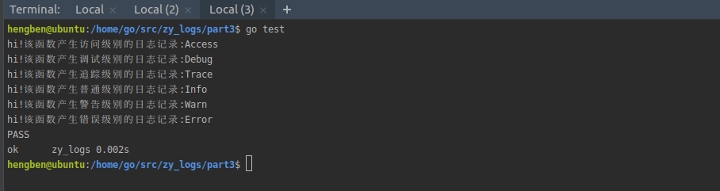

# 原型实现-实现日志库函数

在[上一个章节][第二章]已经定义了一些要用到的数据结构，如果之后的开发过程中可能还需要定义数据结构，到时候会具体讲解的

这章节就实现日志库需要用到的函数或者方法，首先可以肯定的是对外暴露的日志级别函数。

## 定义对外暴露的日志级别函数

在logs.go文件中加入如下代码
```go
    package zy_logs
    
    import (
    	"fmt"
    	"sync"
    	"time"
    	"context"
    )
    
    //定义日志等级数据类型，便于后面定义日志等级属性
    type LogLevel int
    
    var (
    	initOnce    *sync.Once = &sync.Once{} //这个主要是解决多线程调用日志库带来的并发问题
    )
    
    //日志记录数据中可能会加入其他字段，例如访问日志会传入用户名等字段
    type KeyVal struct {
    	key interface{}
    	val interface{}
    }
    
    type LogField struct {
    	kvs []KeyVal
    	fieldLock  sync.Mutex //加锁防止并发问题
    }
    
    //定义日志数据结构
    type LogData struct {
    	curTime         time.Time   //日志记录的当前时间
    	message         string   //日志信息
    	timeStr         string   //日志记录当前时间的格式化
    	level           LogLevel  //日志级别
    	fileName        string   //产生日志的文件名
    	lineNo          int     //产生日志的文件行号
    	traceId         string  //追踪id便于分布式的聚合
    	serviceName     string  //产生日志的服务名，这里可以在初始化设置
    	fields          *LogField //日志信息的其他字段，比如访问日志，传入用户名等字段
    }
    
    //对外暴露日志函数,将日志分为访问，调试，追踪，普通，警告，错误六种级别
    func Access(ctx context.Context, format string, args ...interface{}) {
    	fmt.Printf("hi!该函数产生访问级别的日志记录:%v\n",format)
    }
    func Debug(ctx context.Context, format string, args ...interface{}) {
    	fmt.Printf("hi!该函数产生调试级别的日志记录:%v\n",format)
    }
    
    func Trace(ctx context.Context, format string, args ...interface{}) {
    	fmt.Printf("hi!该函数产生追踪级别的日志记录:%v\n",format)
    }
    
    func Info(ctx context.Context, format string, args ...interface{}) {
    	fmt.Printf("hi!该函数产生普通级别的日志记录:%v\n",format)
    }
    
    func Warn(ctx context.Context, format string, args ...interface{}) {
    	fmt.Printf("hi!该函数产生警告级别的日志记录:%v\n",format)
    }
```

我们测试一下，这些函数是否正常访问。创建一个logs_test.go文件，这里对测试的知识点不做过多的讲解，如果单元测试知识没掌握的朋友可以去查看相关的教程

```go
    package zy_logs
    
    import (
    	"context"
    	"testing"
    )
    
    func TestLoggerFunc(t *testing.T) {
    	Access(context.Background(), "Access")
    	Debug(context.Background(), "Debug")
    	Trace(context.Background(), "Trace")
    	Info(context.Background(), "Info")
    	Warn(context.Background(), "Warn")
    	Error(context.Background(), "Error")
    }
```

然后在终端中执行go test命令,可以看到输出结果如下：
```text
    hi!该函数产生访问级别的日志记录:Access
    hi!该函数产生调试级别的日志记录:Debug
    hi!该函数产生追踪级别的日志记录:Trace
    hi!该函数产生普通级别的日志记录:Info
    hi!该函数产生警告级别的日志记录:Warn
    hi!该函数产生错误级别的日志记录:Error
    PASS
    ok      zy_logs 0.002s
```




则说明定义的函数可以正常使用，之后每当完成一个功能的单元测试就不再此教程中演示了，因为大同小异大家可以以此类推。

接下来开始初始化日志库，在consts.go 文件中定义日志数据结构用到的分隔符常量
```go
package zy_logs

const (
	//日志级别
	LogLevelDebug  LogLevel = iota
	LogLevelTrace
	LogLevelAccess
	LogLevelInfo
	LogLevelWarn
	LogLevelError
)

const (
	DefaultLogChanSize = 20000
	SpaceSep           = " "
	ColonSep           = ":"
	LineSep            = "\n"
)

```
还需要定义一个日志库管理结构体，在logs.go文件中加入一下代码
```go
//定义一个日志管理结构
type LoggerMgr struct {
	outputers      []Outputer  //日志输出器
	chanSize       int     //管道缓冲区大小
	level          LogLevel    //日志等级
	logDataChan    chan *LogData  //分配日志管道
	serviceName    string   //产生日志服务名称
	wg             sync.WaitGroup   //阻塞等待日志协程写完才继续执行程序
}
```
 紧接着定义一个LoggerMgr 类型的变量lm，定义默认服务名变量defaultServiceName
 定义初始化日志方法initLogger, 
```go
//定义初始化日志方法
func initLogger(level LogLevel, chanSize int, serviceName string) {
	initOnce.Do(func() {
		lm = &LoggerMgr{
			chanSize:chanSize,
			level:level,
			serviceName:serviceName,
			logDataChan:make(chan *LogData,chanSize),
		}
	})
}
```
对外公开初始化日志方法
```go
//定义对外初始化日志
func InitLogger(level LogLevel,chanSize int,serviceName string)  {
	if chanSize <= 0{
		chanSize = DefaultLogChanSize;
	}

	initLogger(level,chanSize,serviceName)
}
```
至此logs.go文件修改如下：
```go
package zy_logs

import (
	"fmt"
	"sync"
	"time"
	"context"
)

//定义日志等级数据类型，便于后面定义日志等级属性
type LogLevel int

var (
	defaultServiceName     =   "default" //定义默认服务名变量
	lm          *LoggerMgr //定义一个LoggerMgr类型的变量
	initOnce    *sync.Once = &sync.Once{} //这个主要是解决多线程调用日志库带来的并发问题
)

//日志记录数据中可能会加入其他字段，例如访问日志会传入用户名等字段
type KeyVal struct {
	key interface{}
	val interface{}
}

type LogField struct {
	kvs []KeyVal
	fieldLock  sync.Mutex //加锁防止并发问题
}

//定义日志数据结构
type LogData struct {
	curTime         time.Time   //日志记录的当前时间
	message         string   //日志信息
	timeStr         string   //日志记录当前时间的格式化
	level           LogLevel  //日志级别
	fileName        string   //产生日志的文件名
	lineNo          int     //产生日志的文件行号
	traceId         string  //追踪id便于分布式的聚合
	serviceName     string  //产生日志的服务名，这里可以在初始化设置
	fields          *LogField //日志信息的其他字段，比如访问日志，传入用户名等字段
}

//定义一个日志管理结构
type LoggerMgr struct {
	outputers      []Outputer  //日志输出器
	chanSize       int     //管道缓冲区大小
	level          LogLevel    //日志等级
	logDataChan    chan *LogData  //分配日志管道
	serviceName    string   //产生日志服务名称
	wg             sync.WaitGroup   //阻塞等待日志协程写完才继续执行程序
}

//定义初始化日志方法
func initLogger(level LogLevel, chanSize int, serviceName string) {
	initOnce.Do(func() {
		lm = &LoggerMgr{
			chanSize:chanSize,
			level:level,
			serviceName:serviceName,
			logDataChan:make(chan *LogData,chanSize),
		}
	})
}

//定义对外初始化日志
func InitLogger(level LogLevel,chanSize int,serviceName string)  {
	if chanSize <= 0{
		chanSize = DefaultLogChanSize;
	}

	initLogger(level,chanSize,serviceName)
}

//对外暴露日志函数,将日志分为访问，调试，追踪，普通，警告，错误六种级别
func Access(ctx context.Context, format string, args ...interface{}) {
	fmt.Printf("hi!该函数产生访问级别的日志记录:%v\n",format)
}
func Debug(ctx context.Context, format string, args ...interface{}) {
	fmt.Printf("hi!该函数产生调试级别的日志记录:%v\n",format)
}

func Trace(ctx context.Context, format string, args ...interface{}) {
	fmt.Printf("hi!该函数产生追踪级别的日志记录:%v\n",format)
}

func Info(ctx context.Context, format string, args ...interface{}) {
	fmt.Printf("hi!该函数产生普通级别的日志记录:%v\n",format)
}

func Warn(ctx context.Context, format string, args ...interface{}) {
	fmt.Printf("hi!该函数产生警告级别的日志记录:%v\n",format)
}

func Error(ctx context.Context, format string, args ...interface{}) {
	fmt.Printf("hi!该函数产生错误级别的日志记录:%v\n",format)
}
```
